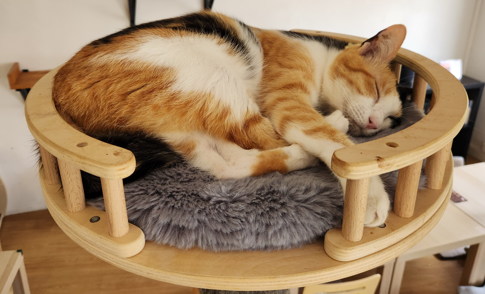

# @opengovsg/starter-kitty

Common app components that are safe-by-default.

## Why `starter-kitty`?

Application security is hard. There are often many ways to get it wrong, and it's easy to make
mistakes when you're trying to ship features quickly. This package provides a set of components that
are safe-by-default, so you can focus on building your app without worrying about common security
footguns.

With `starter-kitty`, you can sleep easier at night. Just like him:

